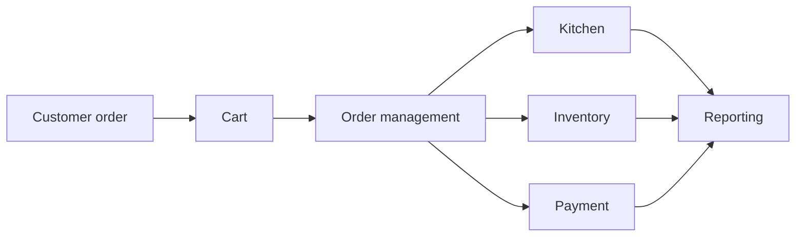

<div align="center">

# 🍽️ Lucid Cash Point

### A legacy restaurant Point of Sale (POS) and operations prototype.

<p>


</p>

**A preserved product experiment covering restaurant sales, kitchen, inventory, and reporting.**

</div>

---

## 🧭 Overview

Lucid Cash Point was originally built as a restaurant Point of Sale and management prototype. The repository is now preserved as a portfolio and product-development artifact while its interface and demonstration are maintained safely.

<table>
<tr><td width="50%">

### 🧾 Sales
Order entry, cart workflows, and daily activity.

### 👨‍🍳 Kitchen
Kitchen and order-management flows.

### 📦 Inventory
Stock tracking and low-stock awareness.

</td><td width="50%">

### 📊 Reporting
Operational reporting and dashboard concepts.

### 💳 Payments
Experiments around African payment providers.

### ⚙️ Operations
Settings and restaurant workflow concepts.

</td></tr>
</table>

## 🔄 Product flow



<details open>
<summary><strong>🖥️ Technology</strong></summary>

Next.js · React · TypeScript · Tailwind CSS · Radix UI · pnpm

</details>

## 🚀 Run locally

```bash
pnpm install
pnpm dev
```

The normal development setup runs through Next.js. A static GitHub Pages workflow is also included for the portfolio demonstration.

<details>
<summary><strong>🌐 GitHub Pages note</strong></summary>

The Pages workflow uses Next.js static export and excludes the legacy server-side payment verification routes because GitHub Pages is static-only. The source application remains preserved in the repository.

</details>

## 📌 Portfolio status

**Legacy product prototype.** The current goal is preservation, presentation, and safe demonstration rather than returning Lucid to active product development.

## 🔐 Ownership

This repository contains proprietary software and documentation. See [`LICENSE`](./LICENSE) for the applicable usage terms.
